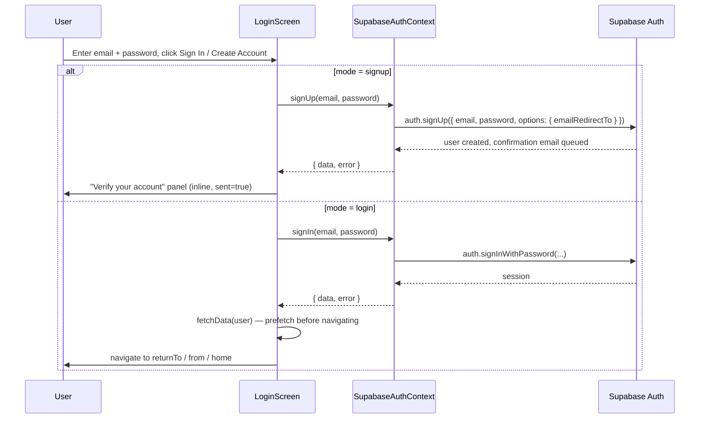
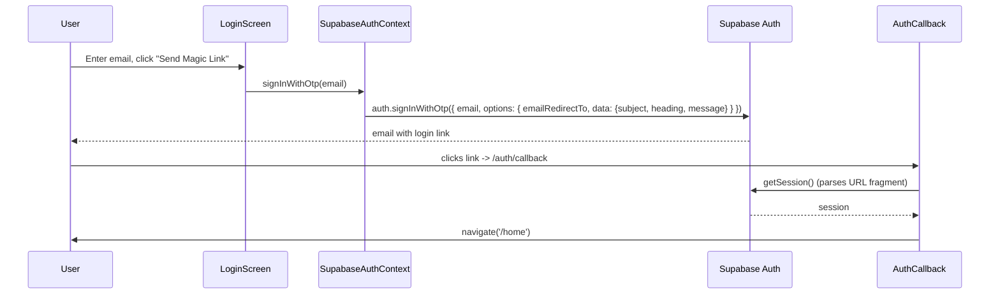
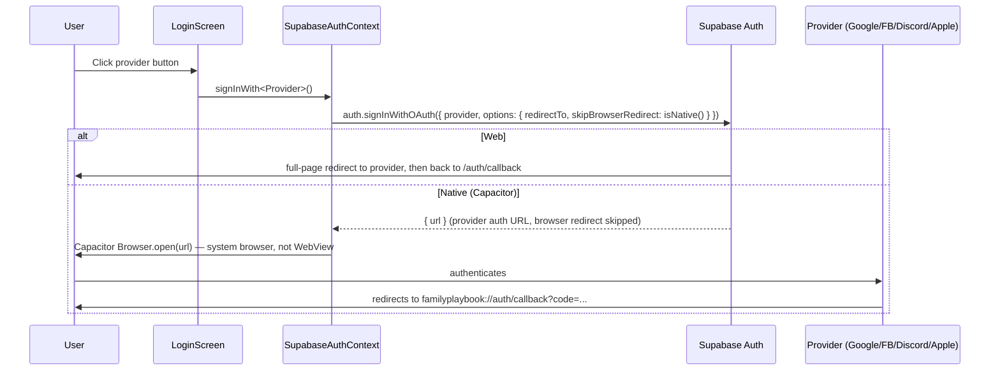
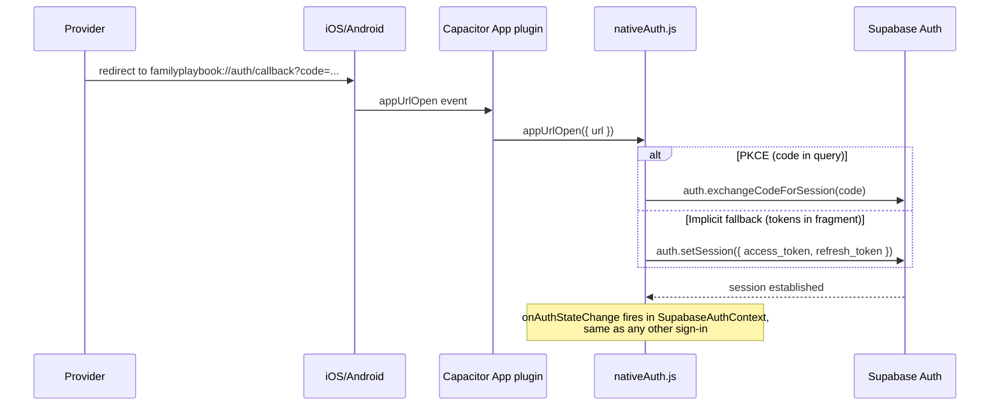
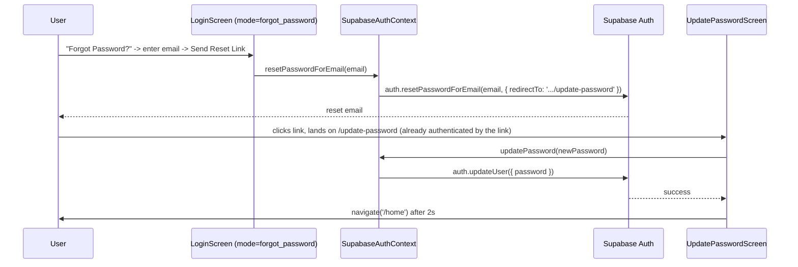
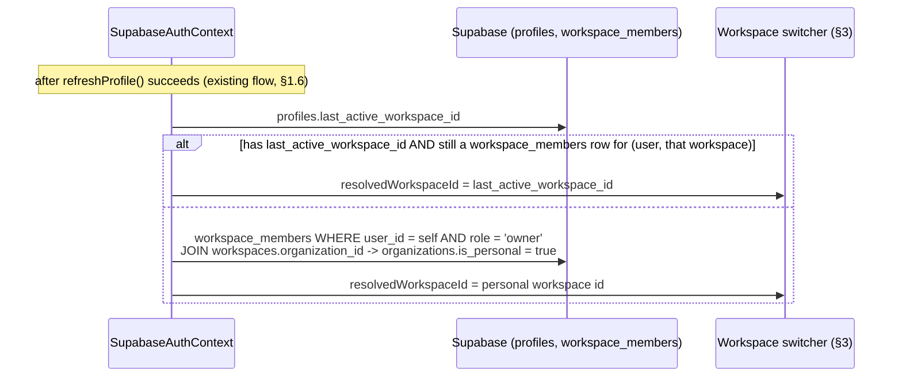
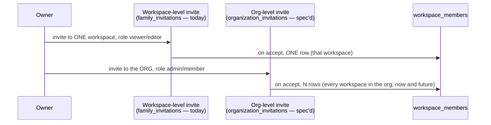
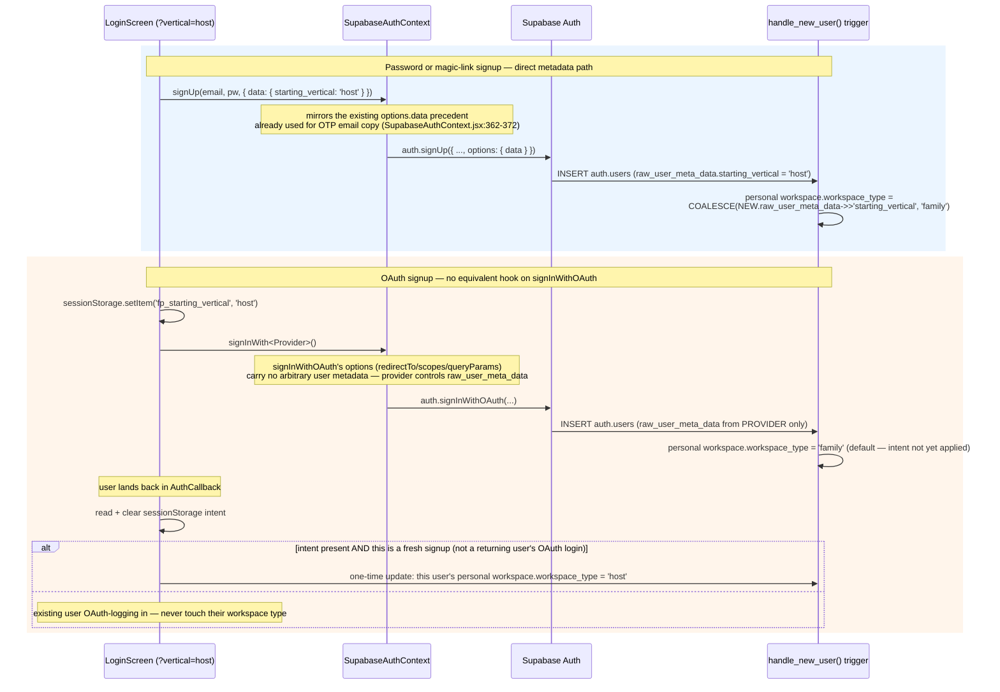

# Auth Flows: Audit + Tenancy Delta

**Status:** Design/spec only. No application code or migrations shipped
with this document. This is the deliverable of Prompt 2
([`PLATFORM_PROMPTS.md`](../../PLATFORM_PROMPTS.md)). Read
[`ARCHITECTURE.md`](ARCHITECTURE.md) first — everything below assumes its
`organizations`/`workspaces`/`workspace_members` design, none of which is
migrated yet either.

Two parts: **§1 is a regression inventory** of every auth flow that exists
today — it is not redesigned, and every future prompt touching auth should
diff against it rather than rediscover these flows from scratch. **§2–5
are the four deltas** this prompt was asked to specify. §6 is the test
matrix covering both.

---

## 1. Existing flows (regression-listed, not redesigned)

### 1.1 Email/password sign in & sign up

Both live in one component, `LoginScreen.jsx`, toggled by local `mode`
state (`'login'` / `'signup'`) — there is no separate `/register` route.



**Invariants to preserve:**
- Signup requires email confirmation before the account is usable
  (`LoginScreen.jsx:105-113`) — no auto-login after signup.
- Login prefetches `DataContext` data before navigating
  (`LoginScreen.jsx:121-127`) so the home screen doesn't flash empty.
- Both share one input form; switching `mode` clears `password` only
  (`LoginScreen.jsx:466-469`), not `email`.
- Toast copy and field validation (`handlePasswordAuth`,
  `LoginScreen.jsx:95-134`) are unchanged.

### 1.2 Magic link (OTP)



**Invariants:** works for both existing users (login) and new emails
(implicit signup — Supabase OTP creates the user) using the *same* call;
`options.data` (custom email subject/heading/message,
`SupabaseAuthContext.jsx:362-372`) is already how this path passes extra
signup metadata — this precedent matters for §4.

### 1.3 OAuth — Google, Facebook, Discord, Apple



**Invariants:** `skipBrowserRedirect: isNative()` is the fork point — web
lets Supabase redirect the page; native explicitly opens the system
browser via `@capacitor/browser` (`SupabaseAuthContext.jsx:318-321`)
because a WebView can't complete OAuth. Google requests `access_type:
offline, prompt: consent` (`SupabaseAuthContext.jsx:355`) — unchanged.
Apple must stay visually equal to the other providers per App Store
guideline 4.8 (comment at `SupabaseAuthContext.jsx:358-360`).

### 1.4 Native deep-link completion



**Invariants:** registered once at boot (`main.jsx:15`,
`initNativeAuth()`), guarded by a `registered` flag so it never
double-registers (`nativeAuth.js:17-22`); entirely web-safe no-op when
`!isNative()`. This listener is a hard dependency for **every** native
OAuth flow in §1.3 — nothing in this prompt touches it.

### 1.5 Password reset



**Invariants:** `/update-password` (`UpdatePasswordScreen.jsx`) has no
`PrivateRoute` guard of its own — it relies on the reset link itself
having authenticated the session; min password length is 6
(`UpdatePasswordScreen.jsx:32-35`).

### 1.6 Session init, restore, and sign-out

- **Boot**: `getSession()` (local storage check) → if present,
  **`getUser()`** to revalidate against the server (not just trust local
  storage) → on `session_not_found`/403, clear state without calling
  `signOut()` again to avoid a 403 loop (`SupabaseAuthContext.jsx:158-214`).
  This two-step validate pattern is deliberate — don't collapse it to
  `getSession()` alone.
- **`onAuthStateChange`** listens for `SIGNED_OUT`/`USER_DELETED` (clear
  state) and `SIGNED_IN`/`TOKEN_REFRESHED`/`INITIAL_SESSION` (refresh
  profile + billing, re-identify RevenueCat) — `SupabaseAuthContext.jsx:221-250`.
- **Realtime billing subscription** re-subscribes whenever `user` changes
  (`SupabaseAuthContext.jsx:253-286`) — unrelated to auth mechanics but
  wired through the same effect; don't let a workspace-resolution change
  disturb this dependency array.
- **Sign out**: checks for a local session before calling the network
  `signOut()` (avoids a spurious 403), then unconditionally clears local
  state in `finally` (`SupabaseAuthContext.jsx:388-409`); `useNavigation`'s
  `'logout'` action calls this then hard-reloads (`useNavigation.js:23-32`).

### 1.7 Route guards & `returnTo`

Two independent mechanisms feed the same post-login redirect logic in
`LoginScreen.jsx:34-53`:

1. **`PrivateRoute`** (`PrivateRoute.jsx`) — any protected route hit while
   logged out redirects to `/login` with **router state**
   `{ from: location }`.
2. **`AcceptInviteScreen`** (`/invite/accept?token=...`) — if not logged
   in, redirects to `/login?returnTo=<url-encoded path+search>`
   (`AcceptInviteScreen.jsx:25-28`) — a **query param**, not router state,
   because an emailed invite link is a fresh navigation with no router
   state to carry.

`LoginScreen` resolves in this order once `session` becomes truthy:
`returnTo` query param (validated by `isSafePath` — must start with `/`,
must not start with `//`, closing the open-redirect hole) → else
`location.state.from` (also validated, and excluded if it's literally
`/login`) → else `handleNavigate('home')`. **This precedence order and
the `isSafePath` check are security-relevant — preserve exactly.**

### 1.8 Known dead surface (flagged, not fixed here)

`/check-email` (`CheckEmailScreen.jsx`, routed at `App.jsx:112`, mapped in
`useNavigation.js:61`) is **unreachable** — `grep -rn "check-email" src/`
outside the route/navmap definitions themselves returns nothing.
`LoginScreen` shows its own inline "check your email" panel instead of
navigating here (`LoginScreen.jsx:517-544`). Same category of finding as
`family_members` in `ARCHITECTURE.md` §3.3 — recorded so a future cleanup
prompt doesn't have to rediscover it, not actioned in this one.

---

## 2. Delta: post-login workspace resolution

**Rule:** last-active workspace if the user is still a member of it, else
their personal workspace.

**New state needed** (not created by Prompt 1): `profiles` gains one
additive, nullable column —

```sql
alter table public.profiles
  add column last_active_workspace_id uuid references public.workspaces(id);
```

`profiles` already holds other per-user app state (`full_name`,
`avatar_url`) and is fetched on every `refreshProfile()` call
(`SupabaseAuthContext.jsx:85`), so resolution can piggyback on data the
client already has in hand at login — no extra round-trip.



**Explicitly scoped down, matching `ARCHITECTURE.md` §6's deferral
pattern:** resolution in this prompt computes and persists *which*
workspace is active and drives the switcher's selected state (§3) — it
does **not** yet change what content `DataContext` loads. `DataContext`
keeps using its `ownerIds` computation (`DataContext.jsx:93-105`)
unchanged until Prompt 3/4 make RLS and queries workspace-aware. This
keeps the same additive-only posture Prompt 1 established: the resolution
*result* exists and is correct, nothing reads it for data-scoping yet.

**Write-through:** `last_active_workspace_id` updates whenever the user
completes a switch in §3's component — not on every page load (that would
turn a read into a write on every navigation for no benefit, since a
single-workspace user's resolution never changes).

**Membership-loss edge case:** if a stored `last_active_workspace_id`
points at a workspace the user is no longer a member of (removed,
declined, org invite revoked), resolution silently falls through to the
personal-workspace branch rather than erroring — same "closed link is a
feature, not an error" posture as `get_shared_content()`
(`DECISIONS.md`'s second entry).

## 3. Delta: workspace switcher (component spec)

**Location:** `AccountLayout.jsx`'s header (`AccountLayout.jsx:53-55`,
currently a static `<h1>My Account</h1>`) — the account section is where
this codebase already puts identity-adjacent chrome (it's the only screen
with a persistent header across sub-tabs, per the existing
Profile/Plans/Settings `Tabs`).

**Visibility rule — literally, not just by convention:** render only when
`workspaces.length > 1` for the signed-in user. Until a second
workspace-creating flow ships (Prompt 8's host onboarding, at the
earliest), **every account has exactly one workspace** — Prompt 1's
bijection guarantees this, and nothing in this prompt's scope creates a
second workspace for anyone. So the switcher is dead code in production
the moment it ships, by construction, the same way `HOST_MODE_ENABLED`
keeps Host Mode dead by a flag — except here the gate is a genuine data
condition, not a build flag, so **no `VITE_*` flag is needed for the
switcher itself.** (An org-level-invite UI, if built later per §4, is
new user-facing surface and would want its own flag — that's out of
scope here.)

**Component contract** (shape, not implementation):

| Aspect | Spec |
|---|---|
| Props in | none required — reads workspace list + current resolution from auth/workspace context (whatever context Prompt 3 lands: `useWorkspace()` or similar; this prompt doesn't create that context, only specifies what it must expose: `workspaces: [{id, name, workspace_type}]`, `activeWorkspaceId`, `switchWorkspace(id)`) |
| Hidden state | `workspaces.length <= 1` → renders `null`. Single source of truth for the count is the same `workspace_members` join used for resolution (§2) — no separate count query. |
| Loading state | While workspace membership is being resolved (brief window right after `refreshProfile()`), render nothing rather than a skeleton — the common case (1 workspace) never shows a skeleton today and shouldn't gain one. |
| Closed/default state | A compact control next to (or replacing) the `<h1>My Account</h1>` — workspace name + a small `workspace_type` badge (e.g. "Family" / "Host"), tap/click opens the list. |
| Open state | List of the user's workspaces, each showing name + type badge + org name if the user belongs to >1 organization; current selection marked. |
| Select | Calls `switchWorkspace(id)` → writes `profiles.last_active_workspace_id` (§2) → closes → (future prompt) re-scopes data. In this prompt's scope, selecting only changes the persisted pointer and the switcher's own selected state — see §2's explicit deferral. |
| Empty/error | A user with zero workspace_members rows should be structurally impossible post-backfill (`ARCHITECTURE.md` §3.1's bijection) — if it happens, treat as a data-integrity bug (log via `errorLogger`, fall back to personal-workspace resolution attempt), not a UI state to design for. |
| Accessibility | Standard disclosure pattern: switcher trigger is a `button` with `aria-haspopup="listbox"` / `aria-expanded`; list is a `listbox` with `role="option"` entries and the current workspace marked `aria-selected="true"` — matches the existing `Tabs` component's a11y posture in the same file. |
| Native | No platform-specific behavior — same component web and Capacitor; nothing about workspace switching touches OAuth/deep-link surfaces from §1.3–1.4. |

## 4. Delta: org-level invites vs. workspace-level invites

**Workspace-level invites — today's `family_invitations`, unchanged.**
Scoped to one workspace (today: implicitly, since every org has exactly
one), role `viewer`/`editor`, entitlement-checked against `editors_max`
per **owner** (`send-family-invite/index.ts:32-53`), 14-day token TTL,
email-bound acceptance (`accept-family-invite/index.ts:45-58`). Per
`ARCHITECTURE.md` §3.3, these keep flowing into `workspace_members` for
their one workspace via the sync trigger. This remains the *only*
relevant invite mechanism for the family vertical and for any single-
workspace organization — which is every account until Prompt 9 lets a
host create multiple property-workspaces under one org.

**Org-level invites — new concept, spec'd here, not built.** Only
meaningful once an organization has more than one workspace: a host who
owns several properties wants to add one team member (e.g. a cleaning
contractor servicing all of their properties) without sending N separate
workspace invites. Proposed shape — a **new**, separate table (not a
rename or repurposing of `family_invitations`, which stays the
family-vertical/single-workspace invite workflow per `GLOSSARY.md`):

```sql
-- Sketch, for a future prompt (Prompt 10-adjacent) — not created here.
create table public.organization_invitations (
  id               uuid primary key default gen_random_uuid(),
  organization_id  uuid not null references organizations(id) on delete cascade,
  invited_email    text not null,
  invited_user_id  uuid references auth.users(id) on delete set null,
  role             text not null check (role in ('admin', 'member')),
  status           text not null default 'pending' check (status in ('pending','accepted','declined','removed')),
  token            uuid not null default gen_random_uuid() unique,
  created_at       timestamptz not null default now(),
  accepted_at      timestamptz
);
```

On acceptance, an org-level invite would project into a `workspace_members`
row for **every current workspace in that organization** (role mapped
`admin → editor`, `member → viewer`, pending Prompt 3's real capability
matrix) — and, if a workspace is added to the org later, the org-level
membership would need to extend to it too (a trigger on `workspaces`
insert, mirroring `ARCHITECTURE.md` §3.3's `family_invitations` sync
trigger shape). That "does org membership auto-extend to new workspaces"
question is exactly the kind of thing worth deciding explicitly when this
is actually built — not assumed here.



**Explicitly out of scope for this prompt:** no migration, no edge
function, no UI. Recorded so Prompt 10 (host teams) doesn't have to
re-derive whether "one invite, many properties" is a real need — it
is, but only once Prompt 9 makes multi-property orgs possible at all.

## 5. Delta: registration starting vertical

**Entry point:** `/login?vertical=host` — a query param on the existing
`LoginScreen`, not a new route or a redesigned form. Matches the
existing `?returnTo=` convention (§1.7) rather than inventing a second
pattern. `LoginScreen` reads `vertical` on mount; when `'host'`, it
adjusts framing copy only (e.g. hero text becomes host-oriented) — same
inputs, same providers, same `mode`/`authMethod` toggle. A marketing
surface (future, out of scope) links here as "For hosts"; absence of the
param is the existing, unchanged default (family).

**Threading the choice through to `handle_new_user()` is not symmetric
across sign-up methods — this is the real design risk in this delta,**
because Supabase's OAuth initiation has no caller-supplied-metadata hook
the way password/OTP signup does:



**The safety rule that matters most here:** an OAuth *login* by an
existing user must never re-read a stale `sessionStorage` intent and
silently reassign their workspace type. "Fresh signup" needs a real
signal, not just "intent flag is present" — proposed: compare the
session's `user.created_at` against wall-clock time (e.g., within the
last couple of minutes counts as "just created"), since `created_at` is
set once at row creation and never changes, unlike `last_sign_in_at`
which updates on every login. Whatever the exact check, it must be
evaluated server-side or against server-issued timestamps, never trusted
from client state alone — the `sessionStorage` flag only supplies
*intent*, never *authorization* to change tenancy data.

**Also flagged, not resolved here:** `sessionStorage` intent must be
cleared immediately after being read (success or failure) so a shared or
reused browser tab can't leak a stale "host" intent into an unrelated
later signup.

`handle_new_user()`'s three-insert bootstrap (`ARCHITECTURE.md` §3.2)
changes its one line for the personal workspace's `workspace_type` from
the hardcoded `'family'` to `COALESCE(NEW.raw_user_meta_data->>'starting_vertical', 'family')`
— everything else in that trigger (the `organizations`/`workspace_members`
inserts, `profiles`, `user_billing`) is untouched.

---

## 6. Test matrix

### 6.1 Regression — existing flows (§1), must be behaviorally identical

| # | Flow | Assertion |
|---|---|---|
| R1 | Password sign up | New account requires email confirmation before first successful sign-in; no session issued immediately after `signUp()`. |
| R2 | Password sign in | Wrong password shows the existing toast copy and does not navigate; correct password prefetches `DataContext` before navigating. |
| R3 | Magic link | Sending a link does not create a visible session; clicking the emailed link lands on `/auth/callback` and reaches `/home`. |
| R4 | OAuth (each of Google/Facebook/Discord/Apple, web) | Full-page redirect round-trip completes and lands on `/home`; button disables the other three providers while one is loading (`disabled={googleLoading \|\| discordLoading \|\| facebookLoading \|\| ...}`). |
| R5 | OAuth (each provider, native) | `skipBrowserRedirect: true` — system browser opens via `@capacitor/browser`, not an in-app WebView redirect. |
| R6 | Native deep-link | `familyplaybook://auth/callback?code=...` completes via `exchangeCodeForSession`; a fragment-only URL (no `code`) falls back to `setSession`. |
| R7 | Forgot password | Reset email link authenticates the session and lands directly on `/update-password` (no separate login step). |
| R8 | Update password | Passwords under 6 chars or mismatched are rejected client-side before any network call. |
| R9 | Session restore on reload | A revoked/expired session (server-side) is detected via `getUser()`, not just trusted from local `getSession()` — user is signed out cleanly, no 403 loop. |
| R10 | Sign out | Local state clears even if the network `signOut()` call itself errors. |
| R11 | `PrivateRoute` redirect | Hitting a protected route while logged out preserves `location.state.from`; login returns there afterward. |
| R12 | Invite `returnTo` | `/invite/accept?token=X` while logged out round-trips through `/login?returnTo=...` and lands back on the accept screen, not `/home`. |
| R13 | Open-redirect guard | A crafted `returnTo=//evil.com` or `returnTo=http://evil.com` is rejected by `isSafePath` and falls through to `/home`. |
| R14 | `/check-email` | Confirmed still unreachable in normal use (§1.8) — not a regression to "fix" by this matrix, just to notice if something starts linking to it unexpectedly. |

### 6.2 New — the four deltas (§2–5)

| # | Case | Assertion |
|---|---|---|
| D1 | First login ever, no `last_active_workspace_id` | Resolves to the personal workspace. |
| D2 | Returning user, `last_active_workspace_id` set and still a member | Resolves to that workspace, not personal. |
| D3 | Returning user, `last_active_workspace_id` points at a workspace they were removed from | Falls back to personal workspace silently — no error surfaced. |
| D4 | User with exactly 1 workspace | Switcher renders nothing (`AccountLayout` header unchanged from today). |
| D5 | User with >1 workspace (test fixture only — not reachable in production yet) | Switcher renders; selecting a workspace persists `last_active_workspace_id` and updates selected state; does not change loaded content (§2's explicit scope limit). |
| D6 | Password/magic-link signup with `?vertical=host` | New account's personal workspace has `workspace_type = 'host'`. |
| D7 | Password/magic-link signup with no `vertical` param | Unchanged: `workspace_type = 'family'`. |
| D8 | OAuth signup with `?vertical=host` | `sessionStorage` intent captured pre-launch, applied post-callback only after confirming this is a fresh signup. |
| D9 | OAuth **login** (existing user) with a stale leftover `sessionStorage` intent from an earlier abandoned signup attempt | Workspace type is **not** touched; intent is cleared regardless. |
| D10 | Workspace-level invite accept (`family_invitations`, unchanged) | Still produces exactly one `workspace_members` row, for the inviting owner's one workspace — no behavior change from Prompt 1's design. |
| D11 | Org-level invite (spec only — no implementation to test yet) | N/A this prompt; recorded so the implementing prompt starts from this matrix instead of a blank page. |

---

## Update the Ledger

See `DECISIONS.md` (new entry for this prompt's design choices),
`TENANCY.md` (workspace-resolution + switcher-visibility summary added),
and `GLOSSARY.md` (no new canonical terms this prompt — "workspace
switcher" and "starting vertical" are UI/flow concepts, not schema/product
nouns needing a glossary row; flagged here rather than added speculatively).
