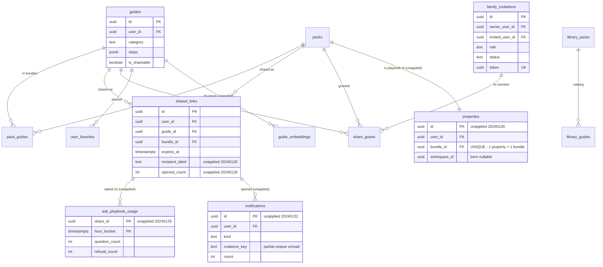
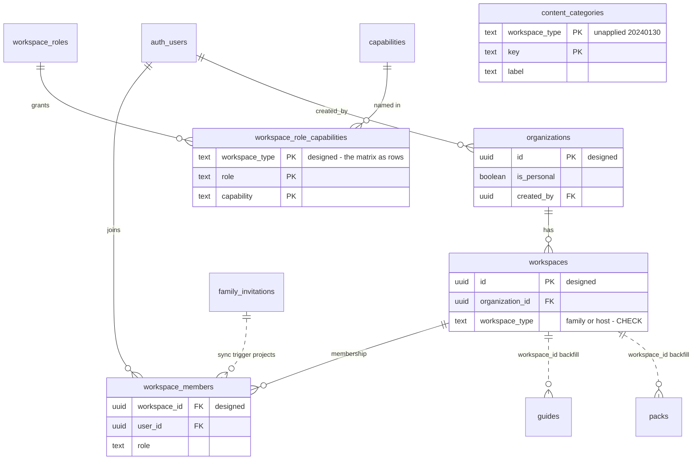

# Data Model — the Diligence Document

**Status:** Canonical data-model reference, cross-checked against the
**live database** on 2026-08-11 (not just the committed snapshot — §6
records exactly what was verified how). Deliverable of Prompt 13.

**Legend, used throughout:**

| Mark | Meaning |
|---|---|
| ✅ | Applied — exists in the live database (verified §6) |
| 🔶 | Migrated-unapplied — SQL committed on this branch (`20240128`–`20240132`), not applied anywhere |
| 📐 | Designed — specified in a Ledger doc, no migration written |

---

## 1. ERD

Three views of one model. FK arrows point child → parent.

### 1.1 Content & sharing (the product core)

(`pack_guides`, `share_grants`, `guide_embeddings`, `library_*` carry only
the keys shown by their arrows; full DDL in the snapshot/migrations.)

### 1.2 Identity, billing, personalization

```mermaid
erDiagram
    auth_users ||--|| profiles : "1 to 1"
    auth_users ||--|| user_billing : "billing truth"
    auth_users ||--o| user_subscriptions : "legacy, still read"
    plans ||--o{ plan_entitlements : "grants"
    plans ||--o{ user_subscriptions : "legacy ref"
    auth_users ||--o{ user_usage : "counters"
    auth_users ||--o{ user_dismissals : "nudge memory"
    auth_users ||--o{ user_secrets : "BYO keys"
    auth_users ||--o{ ai_generations : "AI ledger"
    auth_users ||--o{ feedback : "has"
    auth_users ||--o{ error_logs : "FK without CASCADE"
    auth_users ||--o{ push_subscriptions : "table unused"

    user_billing {
        uuid user_id PK
        text plan_key
        text billing_provider
        text stripe_customer_id
    }
    plan_entitlements {
        uuid plan_id FK
        text feature_key
        bigint feature_value_int
        boolean is_unlimited
    }
    profiles {
        uuid id PK
        text full_name
        text stripe_customer_id "legacy dup - see D4"
    }
    revenuecat_webhook_events {
        text id PK
        text app_user_id "uid as text, NO FK - see F2"
    }
    webhook_events {
        text event_id UK
        uuid user_id "NO FK - see F1"
    }
```

### 1.3 Tenancy & RBAC (designed — no migration written)

Also 📐 (sketches awaiting their first consumer, deliberately unmigrated):
`organization_invitations` (`AUTH_FLOWS.md` §4), `webhook_endpoints`
(`SEAMS.md` §3).

## 2. Owner-boundary of every table

"Keyed today" is the live FK; "boundary" is the *semantic* owner the
tenancy design assigns. Where they differ, `ARCHITECTURE.md` migration #4
(🔶-designed) is the bridge.

| Table | Status | Boundary | Keyed today | Note |
|---|---|---|---|---|
| `guides`, `packs`, `pack_guides` | ✅ | **workspace** | `user_id` | gains `workspace_id` (backfill) |
| `shared_links`, `share_grants` | ✅ | **workspace** | `user_id` | same |
| `family_invitations` | ✅ | **workspace** | `owner_user_id` | projects into `workspace_members` |
| `properties` | 🔶 | **workspace** | `user_id` | born with nullable `workspace_id` |
| `guide_embeddings` | 🔶 | **workspace** | `guide_id`/`user_id` | scope always resolved via share link |
| `ask_playbook_usage` | 🔶 | **workspace** | `share_id` | counts only, never content |
| `profiles`, `user_billing`, `user_subscriptions`, `user_usage`, `user_secrets`, `user_favorites`, `user_dismissals`, `ai_generations`, `feedback`, `error_logs`, `push_subscriptions`, `notifications` 🔶 | ✅/🔶 | **user** | `user_id` | personalization/ledger; deliberately NOT workspace content (`ARCHITECTURE.md` §3.4). `user_billing` becomes org-payable in Prompt 17 without changing its key |
| `plans`, `plan_entitlements`, `stripe_price_map`, `library_packs`, `library_guides`, `content_categories` 🔶 | ✅/🔶 | **global** | — | catalogs; read-only to clients, write via migration/service only |
| `organizations` | 📐 | **org** | `created_by` | the billing+identity boundary itself |
| `workspaces`, `workspace_members`, `workspace_roles`, `capabilities`, `workspace_role_capabilities` | 📐 | org/global | — | roles/capabilities are global catalogs |
| `stripe_webhook_events`, `revenuecat_webhook_events`, `webhook_events` | ✅ | **system** | provider ids | idempotency/ops; see retention findings §4.3 |
| `family_members` | ✅ | **orphan** | `inviter_id` | queried by nothing (see D2) |

## 3. RLS posture summary

Every table has `ENABLE ROW LEVEL SECURITY` — 26/26 live, and all 🔶
tables ship with it. Five postures cover everything:

| Posture | Tables | Shape |
|---|---|---|
| **Owner CRUD** | guides, packs, shared_links, user_* tables, properties 🔶, notifications 🔶 (read/mark-read only) | `auth.uid() = user_id` permissive policies |
| **Owner + member read, editor write** | guides, packs, pack_guides (additional policies) | `is_accepted_family_member()` / `viewer_can_see_*()` helpers |
| **Public-read catalog** | plans, plan_entitlements, stripe_price_map (active), library_* | `USING (true)` — intentionally world-readable; **nothing sensitive may be seeded** into them |
| **Read-only catalog, no write policy** | content_categories 🔶, RBAC tables 📐 | `SELECT TO authenticated` only; writes are migration/service-role — a client that could write the capability matrix could self-grant anything (`RBAC.md` §2) |
| **Service-only** | webhook event tables | `TO service_role` |
| **Restrictive overlays** | guides, packs, pack_guides | the 3 read-only-over-limit `AS RESTRICTIVE` policies — tier limits, orthogonal to identity |

**The two structural rules an auditor should verify hold everywhere:**
(1) **zero `TO anon` policies exist** — all anonymous access flows through
`SECURITY DEFINER` RPCs that return shaped results, never rows
(`RBAC.md` §1.2; re-verified live today: 8/8 sensitive tables return zero
rows to anon while `library_packs` returns data — the control proving RLS,
not a broken request). (2) **A missing write policy fails silently, not
loudly** — PostgREST returns 204 with zero rows matched. This bit
production once (`shared_links` UPDATE, DECISIONS 2026-08-11); new code
paths mitigate with `.select()` after writes.

## 4. Retention & deletion semantics

### 4.1 The delete-account cascade, walked

`delete-account` edge function: explicit deletes for what won't cascade,
then `auth.admin.deleteUser(uid)` and FK `ON DELETE CASCADE` does the
rest.

- **Cascades from `auth.users`** (✅ verified in snapshot FKs): profiles,
  user_billing, user_subscriptions, user_usage, user_secrets,
  user_favorites, user_dismissals, ai_generations, feedback,
  push_subscriptions, guides, packs, shared_links, family_invitations
  (owner; `invited_user_id` is SET NULL — the *other* person's invite
  record survives, correctly), share_grants — and transitively
  pack_guides, and 🔶: guide_embeddings, ask_playbook_usage, properties,
  notifications.
- **Explicitly deleted first by the function**: `error_logs` — its FK has
  **no ON DELETE action**, so without the explicit delete the user delete
  would fail. This is load-bearing: any future table that references
  `auth.users` without CASCADE must either get CASCADE or a line in
  `delete-account`.
- **Read-only-over-limit interplay**: deletion is never blocked by tier
  state — read-only means read-only, not undeletable (RBAC test T30's
  semantics, already live behavior).

### 4.2 Content vs. veneer

`properties → packs` is `ON DELETE RESTRICT` *toward the bundle*:
deleting a property keeps its guides; deleting a bundle that is a
property's playbook is refused until the property goes first. Share-link
deletion cascades from either endpoint (link dies with its content) —
and `ask_playbook_usage`/`notifications` 🔶 cascade with the link, so
usage counts and inbox rows about a link don't outlive it.

### 4.3 Retention findings (the honest section)

- **F1 — `webhook_events.user_id` has no FK at all** (`schema.sql:358`):
  rows survive account deletion with a dangling uid, and their `payload
  jsonb` may embed customer email/ids from Stripe events. Post-deletion,
  this is retained personal data with no linkage constraint. Needs either
  a cascade FK, a scrub in `delete-account`, or a retention window.
- **F2 — `revenuecat_webhook_events.app_user_id` is the Supabase uid as
  text, no FK**: same class as F1 (smaller payload surface — id/type
  only).
- **F3 — `export_user_data()` is not export-complete**: it returns packs,
  guides, favorites, pack_guides — not shared_links, invitations, grants,
  billing, feedback, dismissals, or any 🔶 table. As a GDPR/portability
  answer it under-reports. Pre-existing gap; every new table widens it.
- **F4 — questions/answers**: never stored anywhere, by design
  (`ASK_PLAYBOOK.md` §3#4) — the strongest retention property in the
  system, worth stating affirmatively in diligence.

## 5. Drift findings — cross-check results

Filed per the prompt: *any drift is a bug*.

- **D1 (real bug, chip filed): the snapshot header understates what it
  contains.** `schema.sql:2-4` (written by
  `generate-schema-snapshot.py:23`) instructs a new environment to mark
  migrations "up to and including **20240112**" applied — but the
  snapshot contains `20240113`–`20240117` schema (verified live:
  `revenuecat_webhook_events`, `billing_provider`, `invited_name`,
  `share_grants`, `feedback`, `user_dismissals` all exist). Following the
  instruction replays five migrations onto a schema that already has
  them. Fix: derive the marker from
  `supabase_migrations.schema_migrations` instead of hardcoding.
- **D2: `family_members` is an orphan table** — no code queries it; only
  `recalculate_usage_stats()` reads it, so the `editors` stat it feeds is
  frozen at zero (first recorded `ARCHITECTURE.md` §3.3). Retire-verify-
  drop, `20240104` pattern.
- **D3: `idx_guides_name_gin` is a dead index** — no query uses FTS
  (`SEAMS.md` §1.1). Replaced, not extended, at the search trigger.
- **D4: `profiles` duplicates five legacy Stripe columns** now owned by
  `user_billing` (`stripe_customer_id`, `subscription_status`,
  `price_id`, `subscription_id`, `current_period_end`). Dormant but a
  second, stale place billing state can be read from.
- **D5: `user_subscriptions` is legacy-but-referenced** —
  `send-family-invite` still reads it for `editors_max`
  (`index.ts:33-45`), while everything else uses
  `user_billing.plan_key → plans`. Two subscription sources; the invite
  path should move to `get_user_numeric_limit()`'s chain.
- **D6: `webhook_events` vs `stripe_webhook_events`** — the generic
  legacy table coexists with the `20240107` idempotency table; also
  carries F1.
- **Confirmed non-drift:** all 26 snapshot tables exist live (200s); all
  five 🔶 migrations are absent live (404s / missing column 400) exactly
  as the Ledger records; the snapshot is a faithful superset check of
  migrations `20240101`–`20240117`.

## 6. Verification appendix — what was checked, how

| Claim | Method | Date |
|---|---|---|
| 26 snapshot tables exist live | anon REST probe per table: 200 (RLS-filtered) vs 404 | 2026-08-11 |
| 5 new-migration tables absent live | same probe: all 404 | 2026-08-11 |
| `20240128` columns absent live | `select=recipient_label` → 400 | 2026-08-11 |
| Guest-enumeration posture | 8 sensitive tables → 0 rows to anon; `library_packs` control returns data | 2026-08-11 |
| FK cascade map (§4.1) | read from the committed snapshot (live-generated 2026-07-30) | snapshot |
| Column-level detail generally | snapshot; a live `pg_policies`/`information_schema` diff needs the Management API token, which this session cannot access | snapshot |

The last row is the honest limit: table-level existence is live-verified;
column/policy-level detail rests on a snapshot generated from the live DB
twelve days ago plus the migration history. Regenerating the snapshot
(needs `SUPA_TOK`) closes that gap and D1 together.
